## Задача 0
✅ docker-compose не установлен.\
✅ docker compose установлен.\
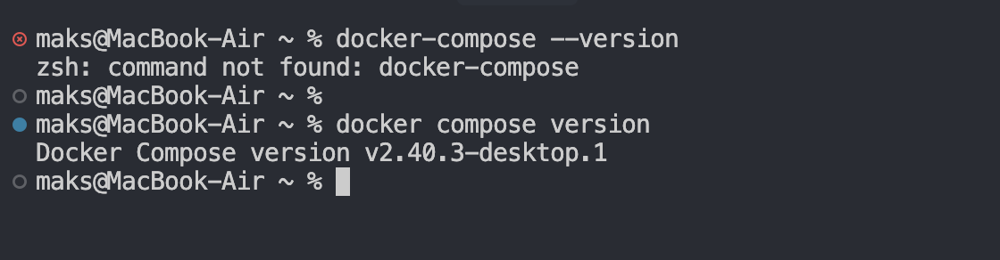

## Задача 1

* [Ссылка на форк репозитория](https://github.com/diasprocod5/shvirtd-example-python)
* Создан `Dockerfile.python` [ссылка на коммит](https://github.com/diasprocod5/shvirtd-example-python/commit/1cc36fcfbd4d73eecdca55cd398b268ecdd91ceb)

```dockerfile

FROM python:3.12-slim AS builder

WORKDIR /app

RUN python -m venv /app/venv

ENV PATH="/app/venv/bin:$PATH"

COPY requirements.txt .

RUN  pip install --no-cache-dir -r requirements.txt
#===========================
FROM python:3.12-slim

WORKDIR /app

RUN addgroup --system python && \
    adduser --system --disabled-password --ingroup python python && \
    chown python:python /app
USER python

COPY --chown=python:python --from=builder /app/venv/ ./venv

COPY --chown=python:python . .

ENV PATH="/app/venv/bin:$PATH"

CMD ["uvicorn", "main:app", "--host", "0.0.0.0", "--port", "5000"] 
```

* Создан `.dockerignore` [ссылка на коммит](https://github.com/diasprocod5/shvirtd-example-python/commit/dfec50e24df942fa12e145de9e3e05c5bb9bcc2a)

```
.gitignore
.git

.env
Dockerfile*
LICENSE
proxy.yaml
*.md
*.pdf

nginx/
haproxy/
```

* Запуск отдельного контейнера MYSQL

```
docker network create app-net

docker run -d \
  --name mysql-db \
  --network app-net \
  -e MYSQL_ROOT_PASSWORD=rootPassword \
  -e MYSQL_DATABASE=myDatabase \
  -e MYSQL_USER=appUser \
  -e MYSQL_PASSWORD=appPassword \
  -p 127.0.0.1:3306:3306 \
  mysql:8.0
  ```

* Запуск и проверка контейнера приложения

```
docker run -d \
  --name my-app \
  --network app-net \
  -p 5001:5000 \
  -e DB_USER=appUser \
  -e DB_PASSWORD=appPassword \
  -e DB_NAME=myDatabase \
  -e DB_HOST=mysql-db \
  hw4-app

# Порт 5000 на хосте занят системной утилитой поэтому запускаю на 5001
```
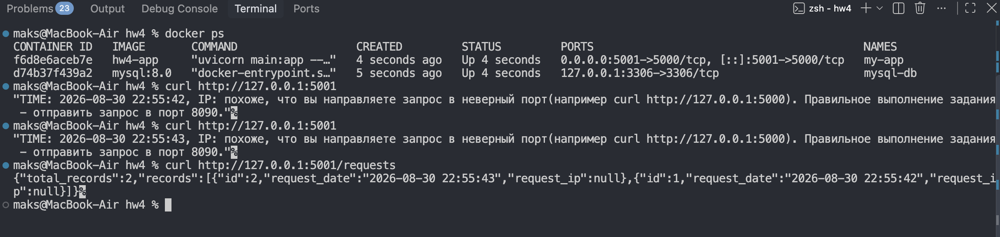

### 1.3 Запуск `main.py` на хосте
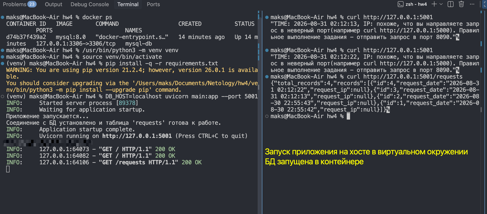

### 1.4 Управление названием таблицы
В `main.py` добавлена переменная `TABLE_NAME` для управления названием таблицы [ссылка на коммит](https://github.com/diasprocod5/shvirtd-example-python/commit/6049148940088b2964d086f5cc75378e4008093a)
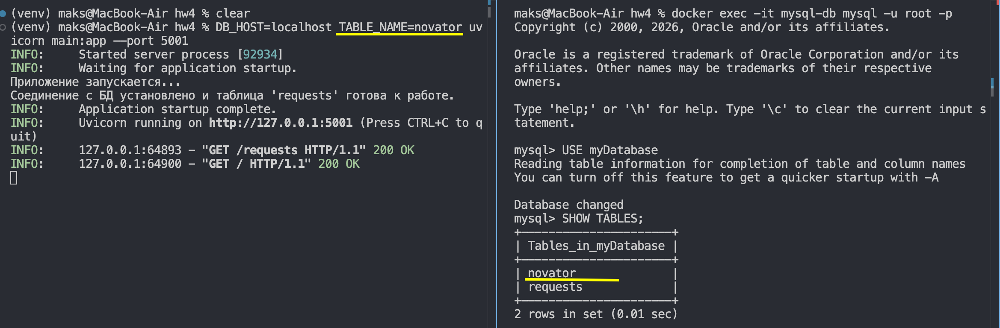


## Задача 2
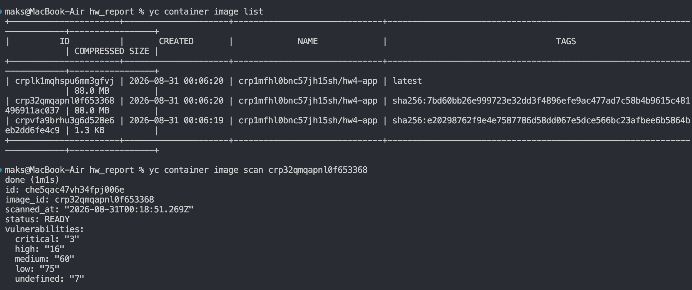

## Задача 3
[ссылка на коммит с compose.yaml](https://github.com/diasprocod5/shvirtd-example-python/commit/6fda13caf96a529479d0b601972c812a25f498ec) 

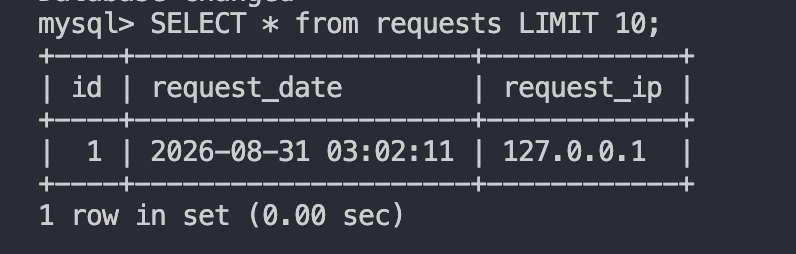

## Задача 4
[ссылка на форк](https://github.com/diasprocod5/shvirtd-example-python)

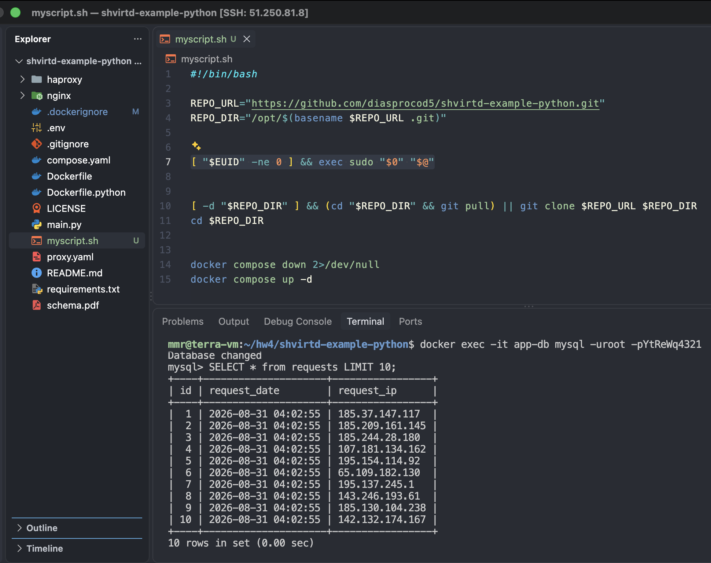

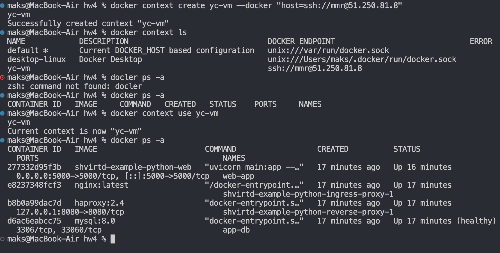


## Задача 5
[Коммит скрипта ](https://github.com/diasprocod5/shvirtd-example-python/commit/d2a9159c69bc5c1e7bb8231173657e6a7650c7a3)


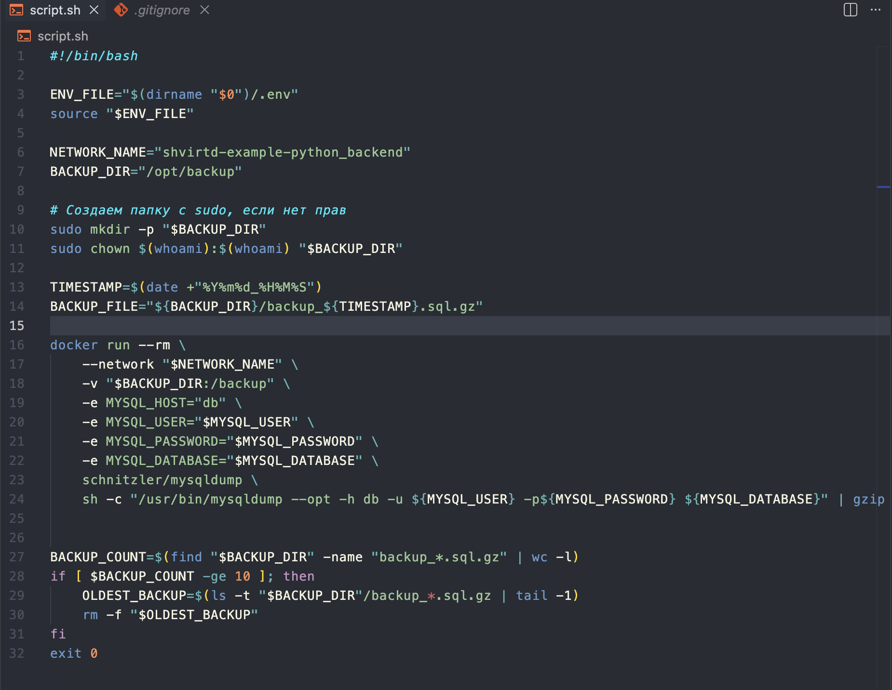

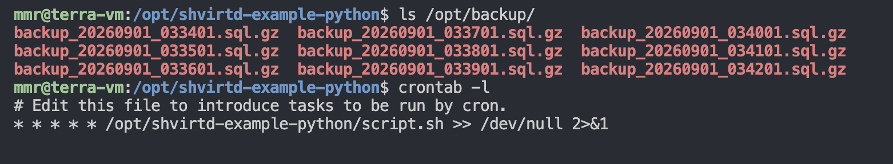

## Задача 6

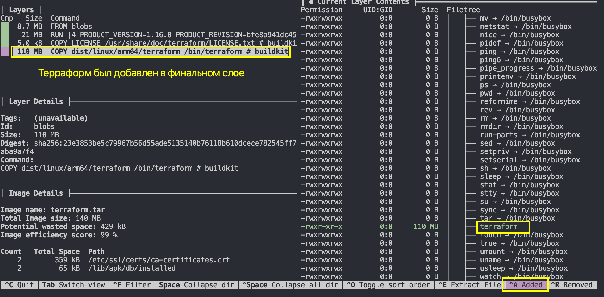

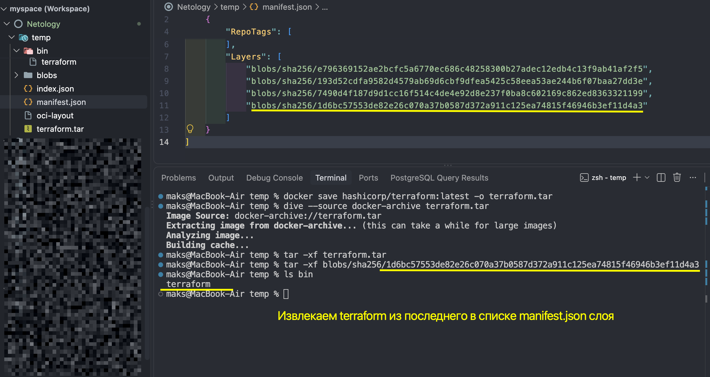
