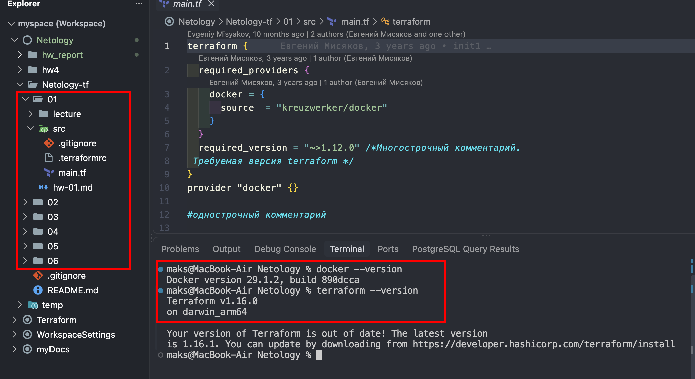
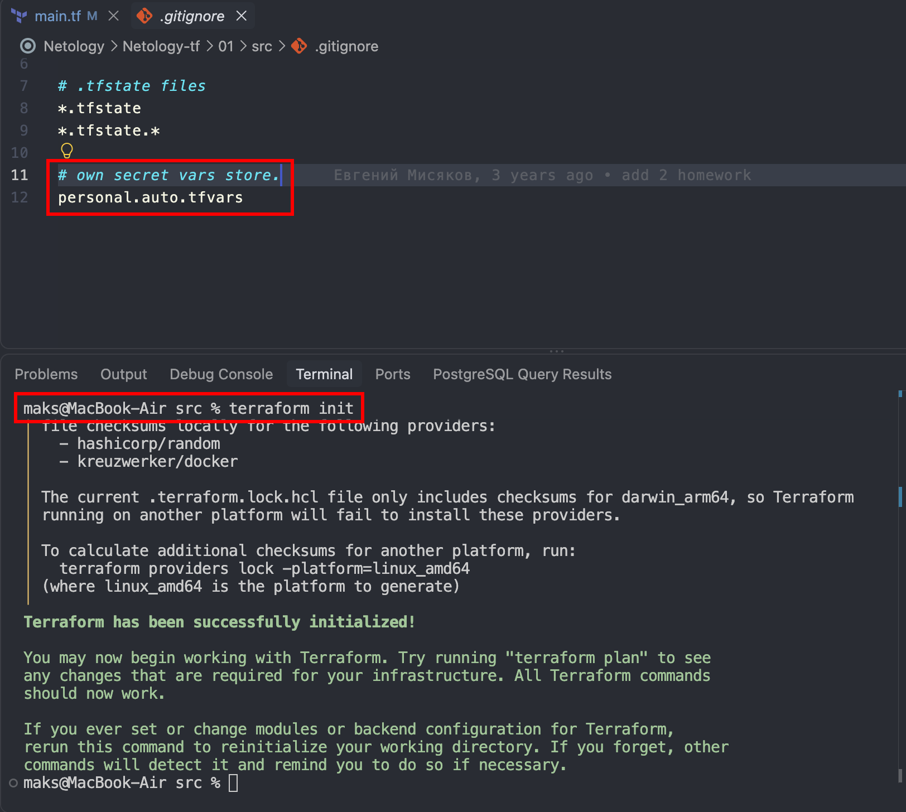
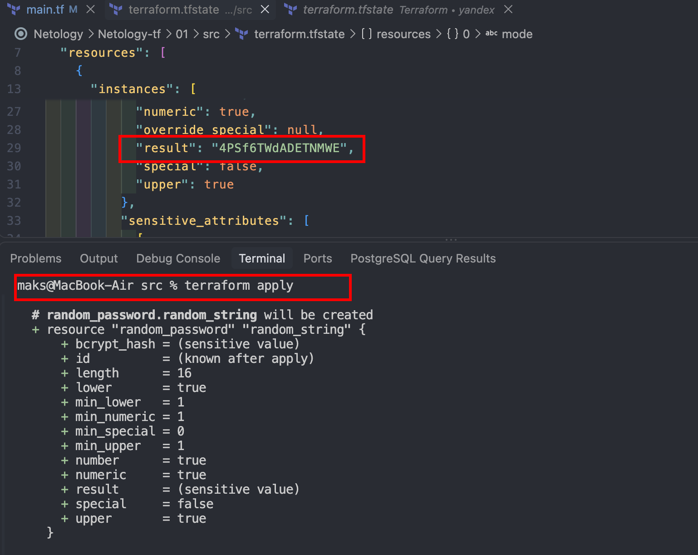
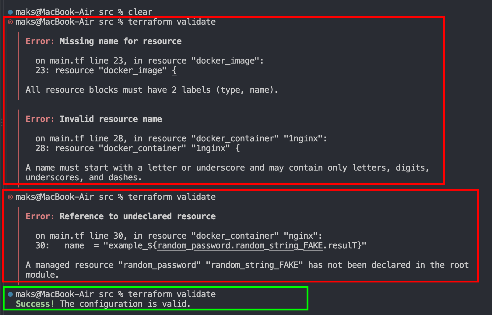
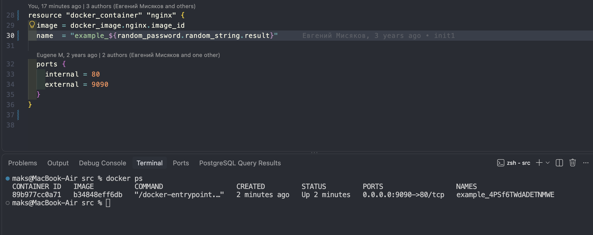
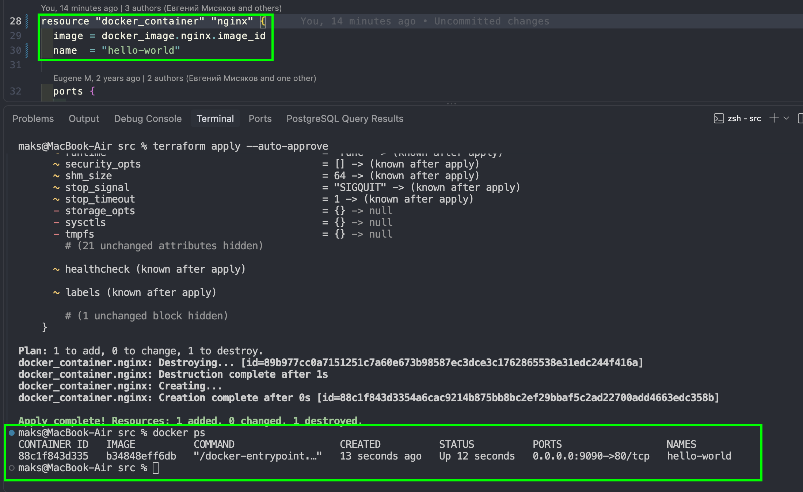
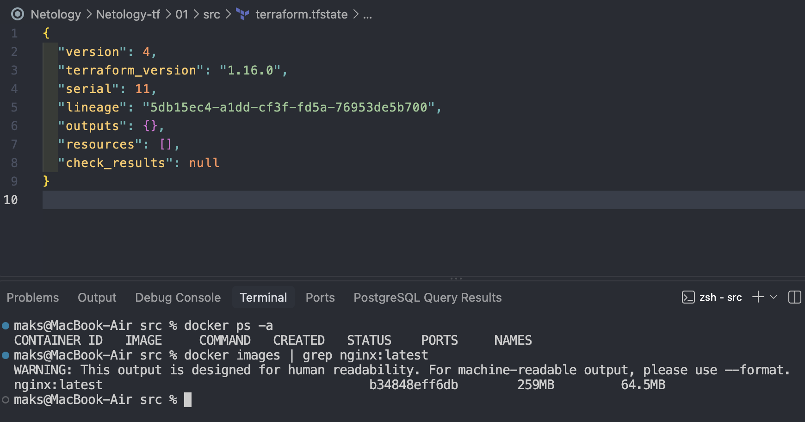
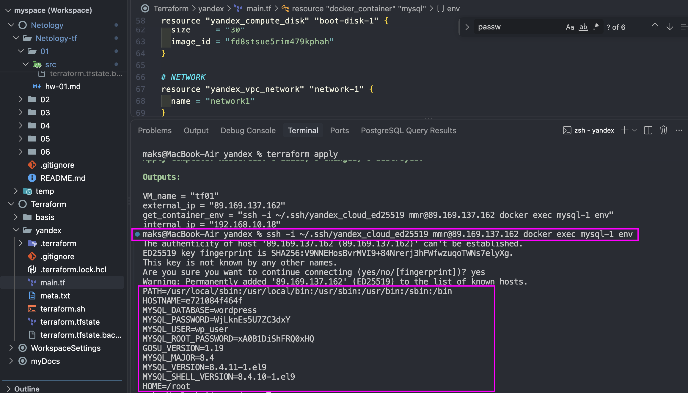

## Подготовка
* Terraform & docker установлены
* Репозиторий загружен на локальную машину


## Задание 1
### 1.1 - 1.2 
* Зависимости установлены `terraform init`
* Файл для хранения чувствительных данных `personal.auto.tfvars`


### 1.3
* `"result": "4PSf6TWdADETNMWE"`


### 1.4
* Отсутствует именование ресурса при инициализации
* Ошибка валидации имени используемого ресурса
* Ссылка на несуществующий параметр


### 1.5


### 1.6
* --auto-aprove в случае ошибки в параметрах применит их без предварительной проверки человеком
* --auto-aprove можно применять в локальных & тестовых окружениях, например docker контейнеры



### 1.7


### 1.8
* Параметр `keep_locally = true` указывает на очищение образа из terraform.tfstate но без удаления из docker
```
keep_locally (Boolean) If true, then the Docker image won't be deleted on destroy operation. If this is false, it will delete the image from the docker local storage on destroy operation.
```

## Задание 2
[Ссылка на репозиторий с файлами](https://github.com/diasprocod5/netology-tf)




