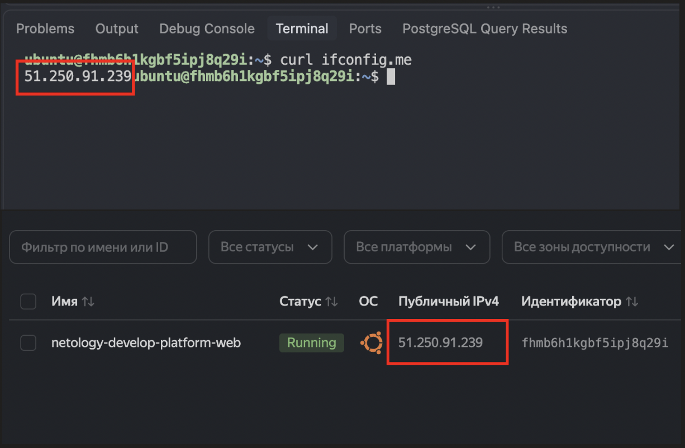
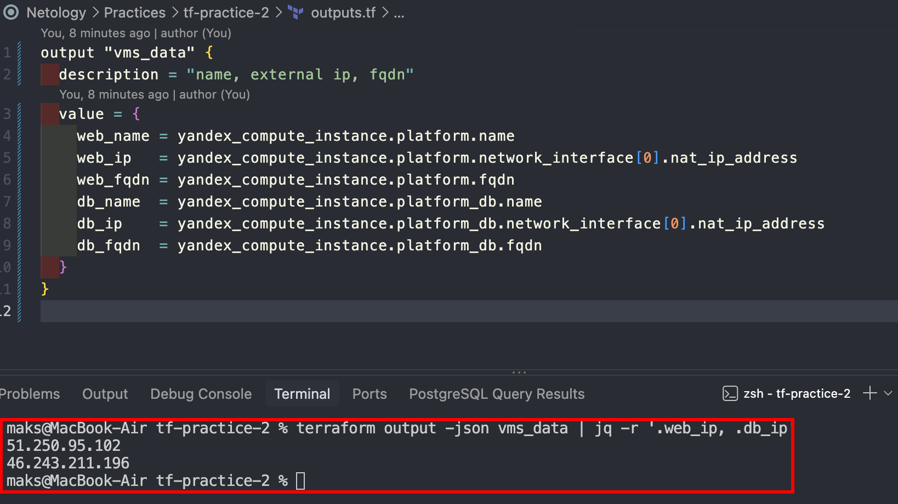
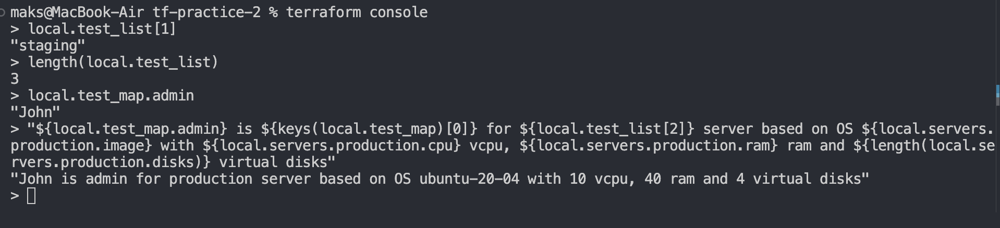

### [Ссылка на репозиторий](https://github.com/diasprocod5/netology-practices/tree/main/tf-practice-2)

### Задание 1
#### 4.1 Ошибка `Platform "standart-v4" not found`: Платформы "standart-v4" не существует, меняем на "standard-v2"
#### 4.2 Ошибка `the specified number of cores is not available on platform "standard-v2"; allowed core number: 2, 4`: для параметра cores недоступно значение 1, меняем на 2.

#### 6. `preemptible = true` - прерываемая ВМ, т.е. может быть автоматически остановлена с сохранением данных, удобно в процессе обучения, так как нам не нужна работоспособность 24/7. `core_fraction=5` каждое ядро получает гарантированные 5% процессорного времени (может получать и больше) для учебных задач такой производительности достаточно. Общий итог - экономия за счет снижения производительности.

#### Скриншот из ЛК и консоли ВМ

### Задание 4

### Задание 7

